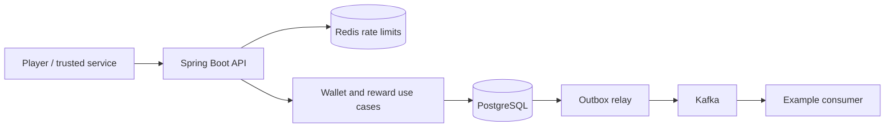

# Wallet Ledger Service — Plan Memory

Recorded: 2026-09-07

## Status and authorization

- This file preserves the architecture and implementation plan from the planning conversation.
- The user explicitly requested: **“Plan first, do not build yet.”**
- No application code, infrastructure configuration, migrations or tests have been implemented.
- Creating this memory file does not authorize implementation. Continue implementation only when the user asks for it.
- The repository initially contained only `README.md`, with one initial commit on `main` and a clean working tree.
- The three product decisions below are explicitly confirmed by the user. Other details are the proposed design, including defaults identified as such.

## User context and working expectations

- The user is a Java Spring Boot backend engineer.
- This is a serious interview assignment. Prioritize demonstrable money correctness, clear design and strong tests.
- Keep explanations concise and simple. Cross-check technical claims against trustworthy primary sources, preferably official documentation.
- During implementation, use the `develop-with-tdd-guardrails` skill: executable acceptance examples, red-green-refactor, real database integration tests, focused mutation testing and small reviewable changes.
- Inspect the repository and applicable instructions again before starting implementation; this file is a context checkpoint, not proof that repository state remains unchanged.

## Confirmed product decisions

1. **Currency:** one in-game currency with whole-number units.
2. **Reward evidence:** a trusted server records action completion; the client requests a claim. The server decides eligibility and reward amount.
3. **Refunds:** full reversal of credits and debits. Reject a reversal if it would overdraw the player. Original ledger records remain unchanged, with at most one reversal per original transaction. Partial refunds and transfer reversals are outside the initial scope.

All three clarification questions have been answered; none remains pending.

## Assignment requirements

Required technology: **Java 21, Spring Boot 3.5.16, PostgreSQL, Redis, Docker Compose, Kafka and Flyway.**

Mandatory wallet capabilities:

- Credit and debit a player's wallet.
- Reject insufficient-funds debits.
- Return the current balance.
- Return paginated transaction history.
- Permanently record every balance change and its reason, including links to rewards, purchases or admin actions.
- Provide request idempotency, concurrency safety, atomic failure behaviour and clear input errors.

Supporting capabilities are part of the planned delivery:

- Daily login streak rewards that increase on consecutive days and reset after a missed day.
- Player-to-player currency transfers.
- Full transaction reversals under the confirmed refund policy.
- Reward claims adjudicated from trusted completion evidence.
- Promotions limited to a fixed number of distinct players.
- Domain events notifying other systems of wallet balance changes.

Evaluation areas: money-moving correctness; service design; concurrency and edge cases; test quality; documentation.

## Proposed architecture and stack

Use one modular Spring Boot application with one PostgreSQL database owning all wallets. All money movement stays within one database transaction.

| Component | Choice and responsibility |
| --- | --- |
| Runtime/build | Java 21, Spring Boot **3.5.16**, Maven Wrapper |
| HTTP | Spring MVC, Bean Validation, consistent `ProblemDetail` responses |
| Persistence | Spring JDBC `JdbcClient`, explicit SQL, HikariCP |
| Database | PostgreSQL 17; authoritative balances, ledger, claims, idempotency and outbox |
| Migrations | Flyway, including the PostgreSQL database module |
| Redis | Distributed API rate limiting |
| Events | Spring for Apache Kafka; Kafka in KRaft mode |
| Security | Spring Security with player, trusted-service and admin permissions |
| Operations | Docker Compose, Actuator, Micrometer, structured logs |
| Testing | JUnit 5, AssertJ, Testcontainers, Awaitility, PIT |

Use the Spring Boot dependency management for Java libraries. Pin explicit container image versions and verify their compatibility during foundation work; avoid floating `latest` tags.

JDBC is chosen to make SQL, locking and transaction behaviour easy to inspect. The trade-off is explicit mapping code.



Proposed package structure, grouped by business capability:

```text
com.example.walletledger
├── wallet
│   ├── api
│   ├── application
│   ├── domain
│   └── infrastructure
├── rewards
│   ├── api
│   ├── application
│   ├── domain
│   └── infrastructure
├── players
├── idempotency
├── messaging
│   ├── outbox
│   └── kafka
└── configuration
```

Controllers translate HTTP and authenticated caller context. Application services coordinate use cases and transactions. Domain code owns money and reward decisions. Infrastructure owns SQL, Redis and Kafka access. All balance changes, including transfers, refunds and rewards, use one wallet posting service.

## Ledger model and invariants

Use an immutable double-entry ledger with a synchronously maintained player balance.

| Operation | Signed ledger entries |
| --- | --- |
| Reward of 100 | Platform issuance account −100; player +100 |
| Purchase of 30 | Player −30; platform purchase account +30 |
| Transfer of 20 | Sender −20; recipient +20 |
| Refund | A new transaction with the original entry signs reversed |

Platform accounts explain currency issuance and consumption. Their totals can be derived from entries, avoiding a shared platform balance row updated for every reward. Player wallets maintain a spendable balance updated atomically with their ledger entries. The player non-negative balance rule does not apply to the platform issuance account's derived total.

Required invariants:

1. Player balances never become negative.
2. Each journal transaction has two distinct accounts, equal and opposite amounts, one currency and a zero sum.
3. Every player balance change has an immutable ledger entry.
4. Each stored player balance equals the sum of that player's ledger entries.
5. Each business entitlement grants at most one reward.
6. Failed money operations do not change balances, ledger entries or reward entitlement state.

Represent currency with Java `long` and PostgreSQL `BIGINT`. Request amounts must be positive whole numbers. Reject zero, negatives, fractions, out-of-range input and arithmetic overflow. Use checked arithmetic and explicit limits.

Every journal transaction records operation type, authenticated actor, reason, source system/business reference and timestamp. Examples of references: purchase ID, mission completion ID and admin ticket. Reward records also preserve the applied policy version.

| Table | Main responsibility and protection |
| --- | --- |
| `player` | Explicit player identity and status |
| `ledger_account` | Player and platform accounts |
| `wallet` | Unique player account, balance and monotonically increasing sequence |
| `journal_transaction` | Operation, actor, reason, source reference, timestamp and optional original transaction |
| `ledger_entry` | Account, signed amount and journal ID; player sequence and balance after |
| `idempotency_request` | Unique caller/key, request fingerprint, stored status and response |
| `outbox_event` | Event ID, wallet sequence, payload, delivery state and retries |
| Reward tables | Definitions, trusted completions, claims, streak state and campaign capacity |

Database safeguards:

- Foreign keys, positive request/journal amount checks and non-negative wallet balance checks.
- Unique player wallet and player wallet sequence constraints.
- Unique business references and entitlement identities scoped appropriately for each operation.
- A unique original transaction reference for full reversals.
- A deferred constraint trigger verifies the complete balanced journal at commit, including a journal header with missing entries. An ordinary cross-row `CHECK` is insufficient.
- The application role cannot update, delete or truncate journal history. Migration privileges are separate.

Double-entry adds schema and validation work, but provides one consistent model for transfers, refunds and reconciliation.

## Transaction boundary and concurrency

Money-moving request flow:

1. Authenticate and validate request shape.
2. Begin a PostgreSQL transaction and reserve the idempotency key.
3. Lock relevant business-state rows, then affected wallets in ascending wallet ID order.
4. Check player existence, eligibility, sufficient funds and recipient balance limits.
5. Write the journal, entries, wallet balances, feature state, outbox events and completed response.
6. Commit before returning the result.

Use `READ COMMITTED` with explicit `SELECT ... FOR UPDATE` wallet locks. A second debit waits for the first writer, then checks the updated balance. A balance of 100 with two concurrent debits of 80 permits exactly one success.

Transfers lock both wallets in the same order regardless of transfer direction. Document and follow the same lock hierarchy across every feature. Keep transactions short; do not perform remote calls while holding money locks.

Set bounded lock/statement timeouts. Retry selected transient database failures with a small bounded policy around the whole transaction, using a fresh transaction for each attempt.

Infrastructure failures roll back all work. Explicit rollback rules cover checked exceptions. Expected business rejections are result values; determine them before mutating money or entitlement state so their idempotency response can commit without partial business changes. Do not catch a database failure and continue committing a damaged transaction.

## Persistent request idempotency and business uniqueness

- Require `Idempotency-Key` on mutating endpoints, scoped to the authenticated caller.
- Fingerprint the operation, target and canonical business payload.
- Same key and fingerprint returns the stored status and response.
- Same key with different content returns `409 IDEMPOTENCY_KEY_REUSED`.
- A PostgreSQL unique constraint coordinates concurrent copies; bounded wait expiry produces a retryable response.
- Reserve the key, execute the operation and save the response in the same database transaction.
- A crash before commit leaves no completed operation. If the HTTP response is lost after commit, retrying the key retrieves the original result.
- Store completed business rejections too. A later, separate attempt needs a new key.
- Do not store authentication failures, malformed requests or transient infrastructure failures as completed business outcomes.
- Retain idempotency records for the project lifetime. A future production retention policy must preserve deduplication guarantees.

Business uniqueness is independent of caller-chosen keys. Enforce database uniqueness for trusted completion claims, one daily reward per player/date, one promotion claim per player/campaign and one full reversal per original transaction. Changing an idempotency key must not create another entitlement.

An idempotent replay returns the original receipt, including its original `balanceAfter`. Use the balance endpoint for current funds.

## Supporting feature behaviour

### Daily login streak

- One grant per player per server-determined UTC date.
- Consecutive days increase the streak; a missed day resets it.
- Proposed demo policy: `10 × streak day` whole units. This formula and UTC boundary are design defaults, not separately confirmed product requirements.
- Inject time for deterministic tests; never trust client timestamps.
- Lock streak state and commit the streak update, claim and wallet credit together.
- Preserve the applied policy version.

### Player transfer

- Sender is the authenticated player, unless using an explicitly privileged service flow.
- Reject self-transfer, missing recipient, insufficient funds and recipient balance overflow.
- Debit and credit use one journal transaction and one PostgreSQL transaction.

### Refund

- Confirmed scope: full reversal of a credit or debit.
- Only an authorized cancellation flow can initiate a refund.
- Append reversal entries linked to the original; never edit the original ledger.
- Enforce one reversal per original transaction, including different idempotency keys racing.
- Reject reward reversal when the player no longer has sufficient currency; make no partial changes.
- Partial refunds and transfer reversals are excluded from the initial scope.
- Proposed default: reversal does not restore reward eligibility or promotion capacity.

### Claim reward

- A trusted service records completion with a unique source event identity.
- The client submits a completion reference, not an authoritative reward amount.
- The server checks ownership, eligibility and prior claims, then selects the configured reward.
- Claim consumption and wallet credit commit together.

### Limited promotion

- Lock the campaign capacity row and enforce one claim per distinct player.
- Reservation, claim and credit commit together.
- Winners follow successful database reservation order.
- Failed claims consume no capacity.

## Proposed HTTP API

| Method and path | Purpose / caller |
| --- | --- |
| `POST /v1/players` | Provision player and zero-balance wallet; trusted service |
| `POST /v1/wallets/{playerId}/credits` | Credit with business reference; trusted service/admin |
| `POST /v1/wallets/{playerId}/debits` | Debit with business reference; trusted service/admin |
| `GET /v1/wallets/{playerId}/balance` | Current committed balance; owner/authorized service |
| `GET /v1/wallets/{playerId}/transactions?cursor=...&limit=...` | Paginated history; owner/authorized service |
| `POST /v1/transfers` | Transfer from authenticated player |
| `POST /v1/transactions/{transactionId}/refunds` | Authorized cancellation |
| `POST /v1/daily-login/claims` | Claim daily login reward |
| `POST /v1/rewards/{rewardId}/claims` | Claim using trusted completion |
| `POST /v1/promotions/{promotionId}/claims` | Claim limited reward |
| `POST /internal/v1/action-completions` | Record completion; trusted service only |

Players cannot grant arbitrary credits or choose reward amounts. Supply reproducible local credentials with separated permissions. Production identity-provider integration details remain to be selected during implementation.

Read balances directly from PostgreSQL. History uses bounded cursor pagination ordered by player wallet sequence, so new entries do not shift older pages. Provide appropriate supporting indexes.

Errors use `ProblemDetail`, stable machine-readable codes and suitable statuses: `400` invalid input, `401/403` authentication/authorization, `404` missing resource, `409` business conflict, `429` rate limit and `503` retryable dependency failure.

## Kafka events and outbox

- Persist one balance-change event per affected player wallet in the money transaction. A transfer produces two linked events.
- Relay workers claim pending rows using database locks and expiring leases, then publish outside the money transaction.
- Mark delivered only after broker acknowledgement.
- Recover expired claims after worker crashes.
- A crash after acknowledgement but before marking delivery can publish a duplicate: the contract is **at least once**.
- Consumers deduplicate by event ID and commit their deduplication record and local effect together.

Event fields: event ID, wallet ID, wallet sequence, journal transaction ID, delta, balance after, reason, timestamp and schema version. Kafka key: wallet ID.

Parallel outbox workers can publish out of database order even with a wallet key. Consumers must explicitly handle sequence numbers. The example consumer should demonstrate duplicate handling and sequence-aware balance projection; do not claim strict publication order or end-to-end exactly-once delivery.

Kafka outages leave committed events pending. Monitor backlog size, oldest pending event and repeated delivery failures. Kafka transactions alone do not make PostgreSQL updates and publication atomic.

## Redis and operational behaviour

- Use an atomic Redis rate-limit counter with expiry, such as a Lua operation.
- Redis does not authorize spending, own balances, enforce reward capacity or store the authoritative idempotency record.
- Proposed failure policy: short Redis timeout and fail-open rate limiting, with PostgreSQL money protections intact and degraded operation observable.
- Include health endpoints, structured correlation/transaction IDs and metrics for rejection rates, lock contention and outbox delivery.
- Reconciliation compares stored balances with ledger sums using a consistent database snapshot.

## Required test evidence

| Scenario | Required assertions |
| --- | --- |
| Credit/debit | Exact balance, journal entries, business reason and outbox records |
| Debit exact balance | Success, final balance zero |
| Insufficient funds | Rejection, no money or entitlement changes |
| **100 concurrent debits of 10 from 500** | **Exactly 50 successes, 50 business rejections, final balance zero** |
| Concurrent credits | No lost increments |
| 100 concurrent copies with one key | One journal transaction and identical completed responses |
| Key reused with changed payload | Conflict, no second movement |
| Same reward with different keys | One credit |
| Opposing transfers | Conserved total, no negatives and no partial transfer |
| Concurrent refunds | Exactly one reversal; original unchanged |
| 500 eligible players / 100 slots | Exactly 100 distinct successful claims |
| Daily login boundaries | Same-day deduplication, consecutive increase, missed-day reset and midnight handling |
| Injected persistence failures | Balances, journal, feature state, idempotency completion and outbox roll back together |
| Lost HTTP response after commit | Retry returns original receipt |
| Kafka outage / relay restart | Recoverable events; duplicate delivery has one consumer effect |
| History during writes | Stable ordering, no duplicate records across cursor pages |
| Invalid inputs and authorization | Zero/negative/fractional/overflow amounts, missing players and unauthorized operations are rejected clearly |
| Direct database safeguard tests | Unbalanced or incomplete journals and forbidden ledger mutations fail |

Test layers:

- Unit tests for arithmetic, funds, eligibility, streak and refund decisions with deterministic time.
- Real PostgreSQL Testcontainers tests for SQL, locks, constraints, Flyway and transaction behaviour; do not substitute H2 or mocks for these guarantees.
- Concurrent tests use independent connections and transactions, coordinated starts and bounded waits. Explicitly hold one wallet lock and prove a competing debit waits.
- A smaller HTTP integration suite uses two application instances sharing PostgreSQL.
- Kafka/Redis integration tests use disposable local containers. No paid or live external services in automated tests.
- PIT targets money decisions; investigate meaningful surviving mutants and ensure critical guard mutations are killed. Invalid or zero-evaluated mutation runs are not passes.
- Direct database tests protect SQL/constraints that mutation tools do not meaningfully exercise.
- Load tests report throughput, latency and lock waits for many-wallet and hot-wallet traffic. Do not invent a performance target before measurement.

## Implementation sequence — pending user instruction to build

For each behaviour, first write and observe the intended failing acceptance/unit test, implement the smallest passing change, then refactor and verify.

1. **Runnable foundation:** Maven Wrapper, required versions, Compose, Flyway, configuration and Testcontainers. Verify clean startup and migration execution.
2. **Ledger foundation:** accounts, zero-balance provisioning, balanced journal constraints, immutable entries and reconciliation.
3. **Credit/debit protection:** transaction boundary, locks, persistent idempotency, business references and outbox insertion. Pass overlapping-debit and duplicate-submission tests.
4. **Core HTTP API:** balance, cursor history, validation, authorization and stable errors.
5. **Transfers/refunds:** shared posting logic, ordered locks, reversal uniqueness and failure rollback tests.
6. **Rewards:** trusted completions, claims, daily streaks and campaign limits, including duplicate-entitlement and quota races.
7. **Messaging/Redis:** outbox relay, example consumer, rate limiting, outage recovery and operational metrics.
8. **Evaluation evidence:** full integration checks, mutation review, load report, demo script and documentation validated from a fresh checkout.

Keep changes small and reviewable. Do not push, publish or merge without user authorization. No such action has been requested in this planning conversation.

## README and delivery expectations

The README must include these five sections:

1. **How to run, setup, database and tests:** prerequisites, configuration, Compose, local credentials, migrations, demonstration requests, test commands and troubleshooting.
2. **Design decisions and trade-offs:** modular architecture, double-entry ledger, synchronous player balances, JDBC choice and outbox.
3. **Concurrency & Idempotency:** transaction boundary, lock ordering, retries, fingerprints, business uniqueness, replay semantics and retention.
4. **Testing approach:** exact concurrent-debit scenario, real database setup, failure injection and mutation evidence.
5. **Assumptions & limitations:** currency, UTC day boundary, reward formula, refund scope, retention, event delivery and scaling limits.

Planned commands, **not yet implemented or executed**:

```sh
docker compose up --build -d
./mvnw test
./mvnw verify
./mvnw -Pmutation verify
```

Version Flyway migrations. After a migration is applied to a permanent environment, make changes through new migrations. Verify startup from an empty database and the applicable upgrade path.

Evaluation mapping:

- Money correctness: ledger invariants, atomic posting, real concurrent debit/transfer tests and reconciliation.
- Service design: feature packages, readable SQL, narrow posting boundary and deterministic domain rules.
- Concurrency/edge cases: ordered locks, persistent idempotency, entitlement uniqueness and explicit failure recovery.
- Test quality: observable balance and record assertions, real infrastructure tests and mutation evidence.
- Documentation: reproducible run/demo/test commands, clear trade-offs and honest limitations.

## Assumptions, limitations and remaining implementation choices

- One database owns all wallets; cross-database/sharded transfers are outside this design.
- A heavily used wallet serializes its writes. Campaign capacity is a deliberate contention point.
- UTC daily boundary and `10 × streak day` rewards are proposed defaults.
- Reversals do not restore entitlement or campaign capacity by default.
- Idempotency records remain for the project lifetime; production archival policy is future work.
- Kafka notifications are eventually delivered and may be duplicated or reordered.
- Compose demonstrates local operation, not high availability. Production requires durable backups, restore procedures and appropriate infrastructure security.
- Exact container patch versions, deployment identity configuration and measured performance baseline remain implementation tasks.
- Preserve **Spring Boot 3.5.16** as required. Its release announcement identifies it as the final open-source release of the 3.5 line; document that lifecycle constraint rather than silently upgrading.

## Official references checked during planning

These references support the technical decisions; the product policies above are design choices or explicitly confirmed user requirements.

- [Spring Boot 3.5 system requirements](https://docs.spring.io/spring-boot/3.5/system-requirements.html)
- [Spring Boot 3.5 managed dependencies](https://docs.spring.io/spring-boot/3.5/appendix/dependency-versions/coordinates.html)
- [Spring Boot 3.5.16 release and lifecycle notice](https://spring.io/blog/2026/06/25/spring-boot-3-5-16-available-now)
- [Spring Framework 6.2 transaction rollback](https://docs.spring.io/spring-framework/reference/6.2/data-access/transaction/declarative/rolling-back.html)
- [PostgreSQL 17 explicit locking](https://www.postgresql.org/docs/17/explicit-locking.html)
- [PostgreSQL 17 transaction isolation](https://www.postgresql.org/docs/17/transaction-iso.html)
- [PostgreSQL 17 constraints](https://www.postgresql.org/docs/17/ddl-constraints.html)
- [PostgreSQL 17 constraint triggers](https://www.postgresql.org/docs/17/sql-createtrigger.html)
- [Kafka delivery semantics and external-system coordination](https://kafka.apache.org/39/design/design/)
- [Redis atomic counter and rate-limit patterns](https://redis.io/docs/latest/commands/incr/)
- [Testcontainers PostgreSQL module](https://java.testcontainers.org/modules/databases/postgres/)
- [PIT mutation testing](https://pitest.org/)
- [Flyway versioned migrations](https://documentation.red-gate.com/fd/versioned-migrations-273973333.html)
